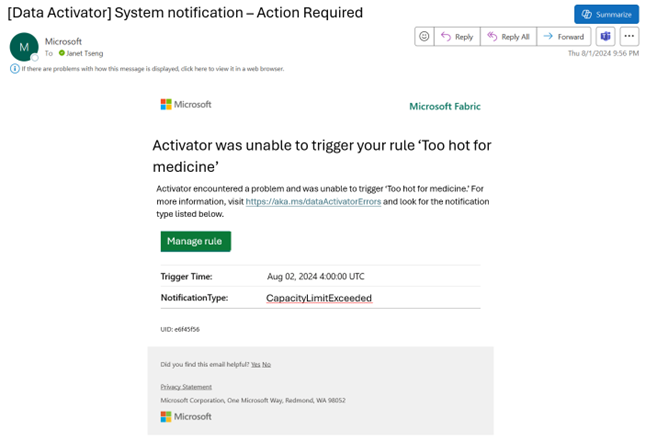
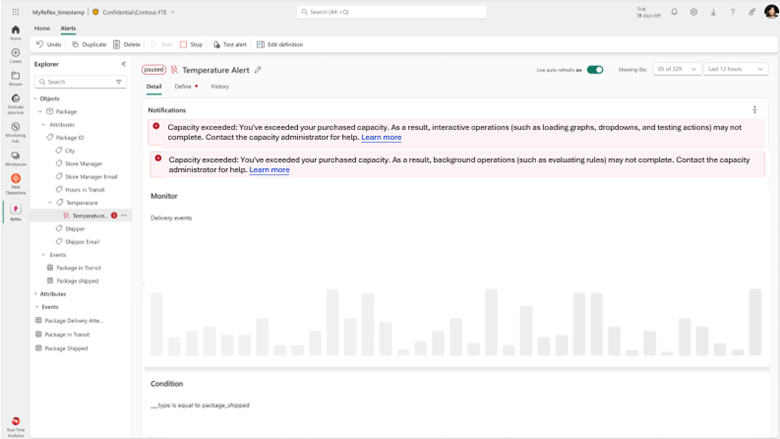

---
# Required metadata
# For more information, see https://review.learn.microsoft.com/en-us/help/platform/learn-editor-add-metadata?branch=main
# For valid values of ms.service, ms.prod, and ms.topic, see https://review.learn.microsoft.com/en-us/help/platform/metadata-taxonomies?branch=main

title: Activator throttling
description: This article explains how Fabric capacity throttling impacts Activator background operations and shows up in the UI.
author:      galir # GitHub alias
ms.author: 'mihart '
ms.service: fabric
ms.topic: concept-article
ms.date:     11/12/2024
ms.subservice: rti-activator
---

# Understanding how Fabric capacity throttling impacts Activator

Throttling occurs when a customer consumes more capacity resources than purchased. Prolonged overload results in degraded performance and gaps in event processing. The [Fabric throttling policy](/fabric/enterprise/throttling) document explains Fabric capacity throttling, its stages, available mitigations, and best practices to prevent it.

## Stages of capacity overload

Activator distinguishes between three stages of capacity overload and throttling.
1.	Capacity overloads lasting between 10 and 60 minutes
2.  Capacity overloads lasting over 60 minutes and up to 24 hours  
3.	Capacity overloads lasting over 24 hours 

### Overloads lasting between 10 and 60 minutes

When a capacity overload lasts between 10 and 60 minutes:

- Activator takes an additional 20 second to load data-aware graphs in the UI.

    
  
- The auto-refresh on charts is automatically disabled. The user can restart auto-refresh by toggling the "Live auto-refresh" toggle back on or by manually reloading the page.

- Data-aware dropdown lists (e.g. the population or time range selectors) load time is delayed by 20 seconds

- Test alerts are sent with a 20 seconds delay

- A banner informs the user that capacity is exceeded and the interactive queries are delayed

    

The delays introduced in this scenario are meant to prevent further overload and prioritize background processing over interactive UI usage to minimize business impact on the customer. The business logic keeps running, while UI operations are delayed.

### For capacity overloads lasting between 60 minutes and up to 24 hours

- All interactive UI operations are rejected:
  - Rejecting showing data-aware graphs
  - Rejecting showing data-aware dropdown
  - Rejecting sending test alert

- A banner informs the user about rejected interactive queries

    

### Capacity overloads lasting over 24 hours

The system starts rejecting background operations.

- System notifications are sent to the artifact owner about each rule pausing evaluations.

    
  
- Banners inform users about the exceeded capacity and rejected interactive and background operations:

    

## Actions you can take to recover from overload situations

When your capacity is throttled and your users experience the above experiences, the users need to work with the Fabric capacity owner to consider and implement one of the available remediation strategies:

- Wait until the overload state is over before issuing new requests.

- Upgrade the SKU of the Fabric capacity.

- Pause/resume the throttled capacity. This will effectively collect the payment for the spike and resume from the clean slate.

- Configure capacity Autoscale

- Move lower priority or overconsuming workspaces out of the capacity.

- If Activator rule executions are causing the overload, consider stopping the rules and adjusting the conditions.

[More on Fabric capacity management](/fabric/enterprise/throttling).
