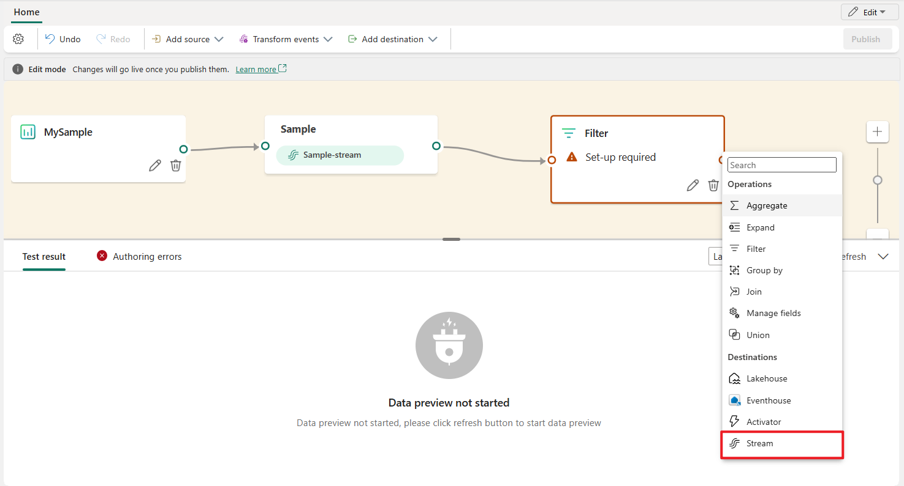
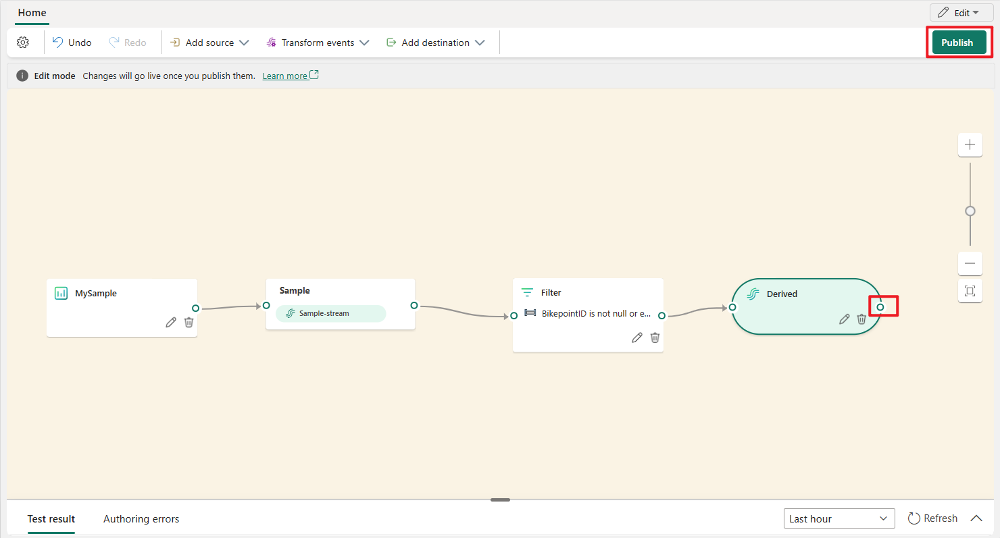
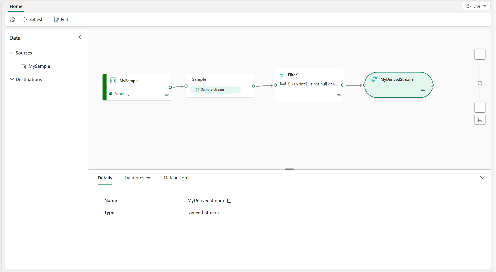

# Add a derived stream destination to an eventstream

This article shows you how to add a derived stream destination to an eventstream in Microsoft Fabric event streams.

You can create a derived stream after doing operations like filtering and aggregating an eventstream. The derived stream is then ready for further consumption or analysis through the Real-Time hub. For more information about derived streams, see [Create default and derived Fabric eventstreams](create-default-derived-streams.md).

## Prerequisites

- Access to a workspace in the Fabric capacity license mode (or) the Trial license mode with Contributor or higher permissions. 

## Add a derived stream as a destination

To route event data to a derived stream destination, follow these steps to add the **Stream** destination.

1. In **Edit mode** for your eventstream, use one of the following ways to create a new stream:

   - Hover over the operator and select the **+** symbol, then select **Stream** as the destination.

     

   - Or, select **Destination** from the ribbon and select **Stream**. Then drag the new derived stream to connect it to the operator node.

     

1. On the **Derived Stream** screen, give the stream a name, specify the data format, and select **Save**.

   

1. After you create the derived stream, it appears in your eventstream on the canvas in **Edit mode**. You can continue processing your data by adding operations and destinations after the derived stream. To implement your changes, select **Publish**.

   

After you complete these steps, the derived stream appears on the canvas in **Live view**, and you can view the **Details**, **Data preview** and **Data insights** in the lower pane.

You can also access this stream in Real-Time hub.

## Related content 

To learn how to add other destinations to an eventstream, see the following articles: 

- [Route events to destinations ](add-manage-eventstream-destinations.md)
- [Custom app](add-destination-custom-app.md)
- [Eventhouse](add-destination-kql-database.md)
- [Lakehouse](add-destination-lakehouse.md)
- [Fabric [!INCLUDE [fabric-activator](../includes/fabric-activator.md)]](add-destination-activator.md)
- [Create an eventstream](create-manage-an-eventstream.md)
